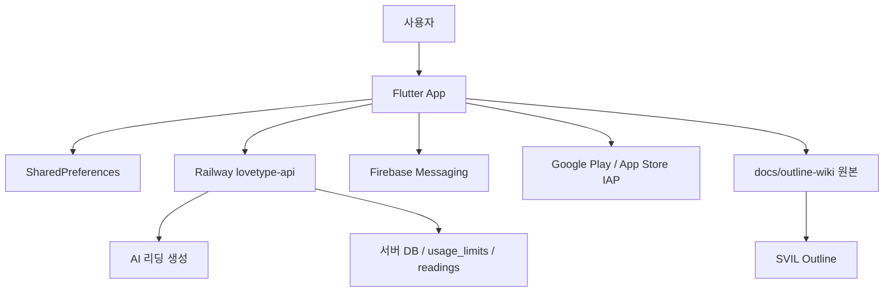

# LoveType Tarot 아키텍처

## 01. 개요

LoveType Tarot은 Flutter 클라이언트가 로컬 프로필/설정을 관리하고 Railway API를 통해 AI 리딩, 결제, 푸시, 히스토리, 쿨타임을 처리하는 구조다.

## 02. 구성도

## 03. 프론트엔드

- Flutter Material 3 기반
- 상태 관리는 `ValueNotifier`와 `ValueListenableBuilder` 중심
- 라우팅은 named routes와 일부 `MaterialPageRoute` 혼합
- 화면별 책임은 `screens/`, 재사용 UI는 `widgets/`, 도메인 로직은 `services/`와 `core/`에 위치

## 04. 백엔드 / API

- API Base: `https://lovetype-api.railway.app`
- 공통 헤더: `Content-Type: application/json`, `X-App-Id: lovetype-tarot`
- 주요 엔드포인트:
  - `POST /api/v1/tarot`
  - `GET /api/v1/tarot/cooltime`
  - `POST /api/v1/tarot/history`
  - `GET /api/v1/payment/balance`
  - `POST /api/v1/payment/use`
  - `POST /api/v1/payment/charge`
  - `POST /api/v1/push/register`
  - `POST /api/v1/auth/google`

## 05. 데이터 저장소

- 앱 로컬:
  - 사용자 프로필
  - 고대비 설정
  - 포인트/구독 캐시
  - 푸시 설정
  - FCM 등록 토큰
  - 히스토리 재전송 큐
- 서버:
  - users
  - user_profiles
  - readings
  - reading_cards
  - usage_limits
  - payments/subscriptions 계열

## 06. 인증 / 권한

- Google 계정 기반 인증 흐름이 준비되어 있다.
- 서버 access token은 `Authorization: Bearer`로 전달 가능하다.
- 로컬 사용자 상태에서도 MVP 히스토리/결제 식별자가 생성된다.

## 07. 배포 / 운영

- Android debug APK 빌드 성공
- 스토어 배포 전 release keystore 설정 필요
- `baseUrl`은 현재 코드 상수이며 flavor 또는 dart-define 분리가 필요
- PNG 덱 3종으로 APK 용량이 크므로 AAB/이미지 최적화 검토 필요

## 08. 보안 / 접근성

- 민감 로그와 FCM token 관련 debug output은 릴리즈 전 점검 필요
- 고대비 모드와 저시력용 덱을 기본 접근성 축으로 유지
- 서버 쿨타임 확인 실패 시 앱은 임의 허용하지 않고 진입을 막는다.

